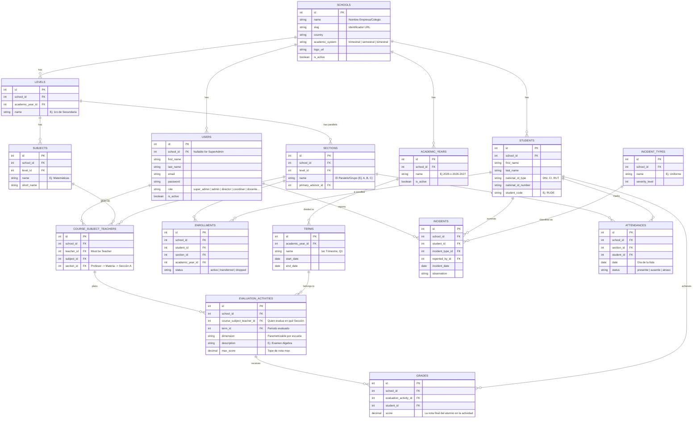

# Database Schema: SaaS Gestión Académica (LATAM Multi-Tenant)

**Enfoque Arquitectónico:** Multi-Tenant Estricto (Aislado por `school_id`)
**Motor DB:** MySQL 8.0+

Para soportar un sistema escalable en LATAM, las entidades están abstraídas (Ej: Sections en vez de Paralelos, Terms en vez de Trimestres). La estructura se ancla robustamente al `school_id` del tenant, y la carga horaria vincula a un docente con una Materia en una **Sección** específica, no en un Grado genérico.

---

## 1. Entity-Relationship Diagram (MERMAID)

## 2. Decisiones y Ajustes de Arquitectura (Sprint SaaS LATAM)

### 2.1 Módulo Empresa (Institucional y Tenancy)
La tabla `SCHOOLS` es la raíz absoluta. Al registrar una tabla de dominio, se le inyectará siempre su `school_id`, implementado a nivel ORM vía Global Scopes. No hay cruce de datos.

### 2.2 Reemplazo de Faltas/Compromisos a Incidentes Configurables (`INCIDENTS` & `INCIDENT_TYPES`)
Las faltas de disciplina y uniformes no están quemadas en la estructura de base de datos. Se manejan vía Catálogo de Tipos (`INCIDENT_TYPES`), permitiendo a cada `school_id` definir si quieren penalizar "Atrasos", "Falta de Uniforme" u otras normas exclusivas de la jurisdicción nacional de la escuela.

### 2.3 Registro Diario de Asistencia (`ATTENDANCES`)
Tabla optimizada para inserción masiva por `Section` (Paralelo). Registra un `status` para centralizar la métrica ("Total presentes vs Ausentes") con un recuento indexado según la `date`.

### 2.4 Evaluaciones y Dimensiones (Desacopladas)
Las actividades evaluativas (`EVALUATION_ACTIVITIES`) almacenan su `dimension` como un metadata flexible parametrizado por escuela (el Ser, Saber, Hacer se definirá dinámicamente) y controlan la puntuación límite mediante su columna `max_score`. Esto asegura que el mismo SaaS opere en Bolivia y en Ecuador simultáneamente sin modificar migraciones.
