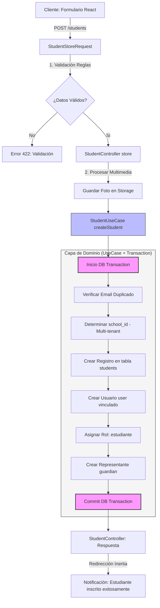

# Flujo de Creación de Estudiante

```mermaid
flowchart TD
    A[Cliente: Formulario React] -->|POST /students| B[StudentStoreRequest]
    B -->|1. Validación Reglas| C{¿Datos Válidos?}
    C -- No --> D[Error 422: Validación]
    C -- Si --> E[StudentController store]
    
    E -->|2. Procesar Multimedia| F[Guardar Foto en Storage]
    F --> G[StudentUseCase createStudent]
    
    subgraph Dominio ["Capa de Dominio (UseCase + Transaction)"]
        H[Inicio DB Transaction]
        I[Verificar Email Duplicado]
        J[Determinar school_id - Multi-tenant]
        K[Crear Registro en tabla students]
        L[Crear Usuario user vinculado]
        M[Asignar Rol: estudiante]
        N[Crear Representante guardian]
        O[Commit DB Transaction]
        
        H --> I --> J --> K --> L --> M --> N --> O
    end
    
    G --> H
    O --> P[StudentController: Respuesta]
    P -->|Redirección Inertia| Q[Notificación: Estudiante inscrito exitosamente]

    style Dominio fill:#f5f5f5,stroke:#333,stroke-width:1px
    style H fill:#f9f,stroke:#333,stroke-width:2px
    style O fill:#f9f,stroke:#333,stroke-width:2px
    style G fill:#bbf,stroke:#333,stroke-width:1px
```